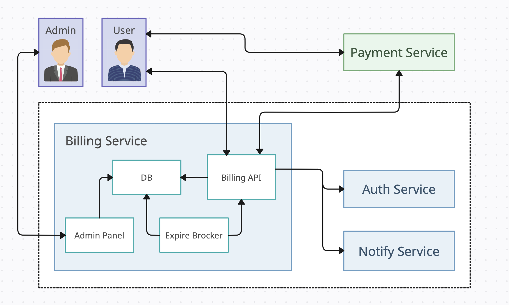

# Проектная работа: диплом

Запуск проекта:
- заполнить env файлы;
- запуск - make up.

Функциональные требования:
- подписка (автоматическое списание);
- отписка;
- отписать + возврат;
- добавить или изменить тарифы;
- получить тарифы.

Нефункциональная требования:
- ответ не больше 200 ms;
- отказоустойчивость;
- безопасность;
- масштабируемость.

